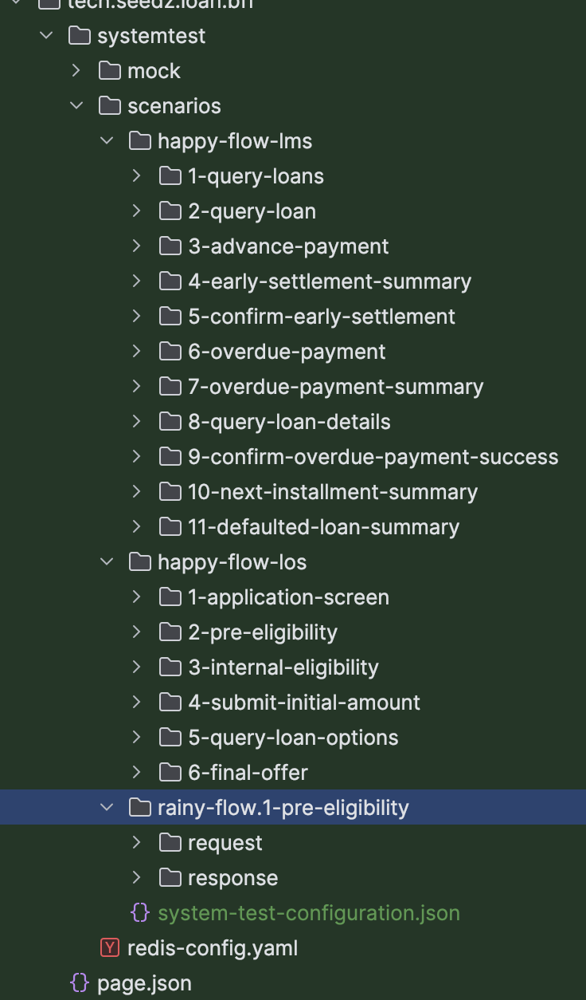

[](https://github.com/INK-Solutions/system-test-framework/actions/workflows/gradle.yml?query=branch%3Amain++)
[](https://mvnrepository.com/artifact/house.inksoftware/system-test-framework)
[](http://www.apache.org/licenses/LICENSE-2.0.txt)

### What is the System Test Framework?

The System Test Framework is our custom a Java-based testing framework.
It is business oriented test framework that allows you to define steps that are part of a business processes, and then make sure business process are executed.

The main features:

1. Launch all the infrastructure that your application needs (postgres db, kafka, mocked server)
2. Launch your application as a spring boot application connected to the infrastructure from step 1.
3. Execute step-by-step requests to your application via publicly exposed interfaces (rest and kafka), checking the correctness of the result.
4. Gracefully shut down the application and all infrastructure created for it.

### Motivation
System Test Framework is used to make sure that all required steps of the business logic have been executed and the result of the processing is correct.

### How it works
With System Test Framework you can treat the application that you test as a black box. It require minimal amount of code to set up. We start the application with embedded database and embedded kafka (if required).
Then we define set of steps that can send REST requests or/and Kafka events as input and validate if the output of the processing is correct.

### Supported infrastructure
#### Databases
- Postgres
- MS SQL
- Redis

#### Messaging system
- Kafka with Avro

#### Mocked Server
With the Mocked Server you can mock any third party API integration.
You can predefine response for any API call required for testing.

### Example implementation

You can find a demo implementation [here](https://github.com/INK-Solutions/system-test-framework-demo).

### Implementing System Test Framework in your project

#### Add dependencies

#### Add the Maven Central dependency to your project

###### Gradle

```
testImplementation 'house.inksoftware:system-test-framework:21.0.0'
```

###### Maven
```
<dependency>
<groupId>house.inksoftware</groupId>
<artifactId>system-test-framework</artifactId>
<version>21.0.0</version>
</dependency>
```
#### Create configuration
Create `system-test-configuration.json` in test `resources` directory, that defines your infrastructure.
**This is mandatory file.**

###### Full configuration example
```json
{
  "infrastructure": {
    "kafka": {
      "topics": [
        {
          "name": "loan-approval-request",
          "schema": "house.inksoftware.avro.generated.loan.LoanApprovalRequest",
          "direction": "publish"
        },
        {
          "name": "loan-approval-response",
          "schema": "house.inksoftware.avro.generated.loan.LoanApprovalDecision",
          "direction": "read"
        }
      ]
    },
    "database": {
      "type": "postgres",
      "image": "postgres:11.1",
      "testDataScriptsPath": "db/"
    },
    "mockedServer": {
      "path": "tech/example/scenarios/3rd-party-contract.json",
      "warmupSeconds": 5
    }
  }
}
```

###### Database
Required parameters:
- type: `postgres, mssql, redis`
- image: container image you want to execute
- testDataScriptsPath: optional parameter to folder where test data is stored and executed after flyway

###### Kafka
Required parameters:
- topics: list of topics you want to create
  - name: topic name
  - schema: class of the Avro Schema
  - direction: `publish, read`
    - `publish` - when tested component is writing to the topic
    - `read` - when tested component is consuming from topic

###### Mocked Server
- path: path to JSON configuration file
- warmupSeconds: optional parameter - seconds to wait before server is ready, default value is 5

###### Mocked Server configuration:
In Mocked Server configuration you define configuration for your expected API calls with corresponding responses.
[Full documentation can be found here](https://www.mock-server.com/mock_server/getting_started.html#request_properties_matchers)

Please note that Mocked Server is started on `port 1080`, therefore you need to make sure that in your System Tests configuration you set your API base url as `http://localhost:1080` 

Example:
```json
[
  {
    "httpRequest": {
      "method": "GET",
      "path": "/api/kyc/validation",
      "queryStringParameters": [
        {
          "name": "clientId",
          "values": ["fake-client-id"]
        }
      ]
    },
    "httpResponse": {
      "body": "{\"clientId\": \"fake-client-id\", \"validationResult\": \"APPROVED\"}"
    }
  },
  {
    "httpRequest": {
      "method": "GET",
      "path": "/yakeen/api/v1/person/1094208525/owns-mobile/966598452467"
    },
    "httpResponse": {
      "body": "{\"referenceNumber\":\"a8f57862-f0ab-11ed-a05b-0242ac120003\",\"id\":\"1094208525\",\"mobile\":\"598452467\",\"isOwner\":true}"
    }
  },
  {
    "httpRequest": {
      "method": "POST",
      "path": "/nafath/api/v1/request",
      "body": "{\"service\":\"ID_VERIFICATION\",\"legalId\":\"1094208525\"}"
    },
    "httpResponse": {
      "body": "{   'requestId': '51e1d1b4-f0ac-11ed-a05b-0242ac120003',   'transactionId': '6727e6a8-f0ac-11ed-a05b-0242ac120003',   'randomNumber': '75',   'waitingTimeSeconds': 180 }"
    }
  },
  {
    "httpRequest": {
      "method": "POST",
      "path": "/nativeoauth/oauth2/token"
    },
    "httpResponse": {
      "body": "{access_token: mocked-access-token, expires_in: 10000000}"
    }
  },
  {
    "httpRequest": {
      "method": "POST",
      "path": "/api/Merchant/GetAllResidentInfo"
    },
    "httpResponse": {
      "body": "{ \"firstName\": \"FirstName\", \"secondName\": \"SecondName\", \"thirdName\": \"ThirdName\", \"lastName\": \"LastName\", \"fatherName\": \"FatherName\", \"grandFatherName\": \"GrandFatherName\", \"subtribeName\": \"SubtribeName\", \"familyName\": \"FamilyName\", \"englishFirstName\": \"EnglishFirstName\", \"englishSecondName\": \"EnglishSecondName\", \"englishThirdName\": \"EnglishThirdName\", \"englishLastName\": \"EnglishLastName\", \"gender\": \"M\", \"idExpiryDate\": \"1445-01-01\", \"yakeenStatus\": 0, \"iqamaExpiryDateH\": \"1445-01-01\",  \"nationality\": \"SAU\", \"country\": \"SAU\" }",
      "headers": [ { "name": "Content-Type", "values": [ "application/json; charset=utf-8" ] } ]
    }
  }
]
```

#### Application configuration file
Make sure that you application configuration file for system tests is `application-systemtest.yml` 

#### Create system test
```
import house.inksoftware.systemtest.SystemTest;
import org.springframework.boot.test.context.SpringBootTest;
import org.springframework.boot.test.context.TestConfiguration;
import org.springframework.context.annotation.Primary;
import tech.example.infrastructure.events.incoming.KafkaEventProcessedCallback;

@SpringBootTest(classes = {DefaultSystemTest.SystemTestKafkaEventProcessedCallback.class}, webEnvironment = SpringBootTest.WebEnvironment.RANDOM_PORT)
public class DefaultSystemTest extends SystemTest {
    @TestConfiguration
    @Primary
    public static class SystemTestKafkaEventProcessedCallback extends house.inksoftware.systemtest.domain.config.infra.kafka.incoming.KafkaEventProcessedCallback implements KafkaEventProcessedCallback {
    }
}
```

#### Define test steps
###### Directory structure


```
test
  /resources
    /house.ink.software.scenarios
      /test-name-1
        /step-1
        /step-2
        /...
      /test-name-2
        /step-1
        /step-2
      /...
    system-test-configuration.json
  application-systemtest.yml  
```

- You can define multiple test flows.
- Order of test steps is defined by a number at the beginning of test step directory name.
- Each test step must contain `request` and `response` directories.
- `rest-request.json` defines a REST call that will be executed in the step.
- `kafka-request.json` defines an event that will be published to Kafka
- `rest-response.json` defines an expected REST response
- `event.json` defines an expected Kafka event that is emitted after request step
- `kafka-request-processed.json` defines an expected Kafka request id that should be emitted after request step

###### Callbacks
You can define callbacks that capture required data in test context and can be reused later.
For example you can add below part to the `rest-request.json`. It will find `id` in a response and store it in the system context in `loanId` parameter.
You can later use in the next test step with `"loanId": {{loanId}}`.  
```
  "callback": {
    "loanId": "id"
  }
```

###### rest-request.json
```json
{
  "url": "/api/template/loan-requests",
  "method": "POST",
  "type": "PUBLIC",
  "headers" : {
    "api-key": "dummy-api-key"
  },
  "body": {
    "clientId": "fake-client-id",
    "amount": "2300.55"
  },
  "callback": {
    "loanId": "id"
  }
}
```

###### kafka-request.json.json
```json
{
  "topic": "loan-approval-response",
  "body": {
    "id": "system-test-loan-approval-response-id",
    "loanId": {{loanId}},
    "approved": true
  }
}
```

###### rest-response.json.json
```json
{
  "httpCode": 200,
  "body": {
    "clientId": "fake-client-id",
    "amount": 2300.55,
    "approved": false,
    "kycValidationResult": "APPROVED"
  }
}
```

###### event.json
```json
{
  "topic": "loan-approval-request",
  "body": {
    "clientId": "fake-client-id",
    "amount": 2300.55
  }
}
```

###### kafka-request-processed.json
```json
{
  "kafkaRequestId": "system-test-loan-approval-response-id"
}
```

###### Querying database
You can define a step where you can validate data stored into database.
You can also use queried data in your next steps.

1. Create new test step directory.
2. Create `db-request.json`
```json
{
  "query": "select name as result from main.users where email='system-test@gmail.com'",
  "resultVariableName": "userName"
}
```
User named will be stored in test context as in userName placeholder.

3. If you want to use user name in next steps, you can do it by using `{{userName}}` placeholder.
Example:
###### rest-request.json
```json
{
  "url": "/api/public/user?name={{userName}}",
  "method": "GET",
  "body": {
  }
}
```


### License

System Test Framework is published under the Apache License 2.0, see http://www.apache.org/licenses/LICENSE-2.0 for details.
